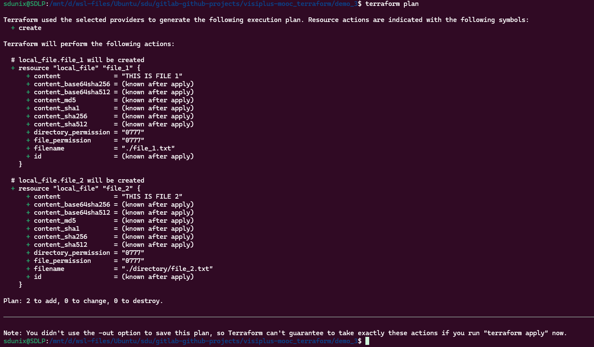
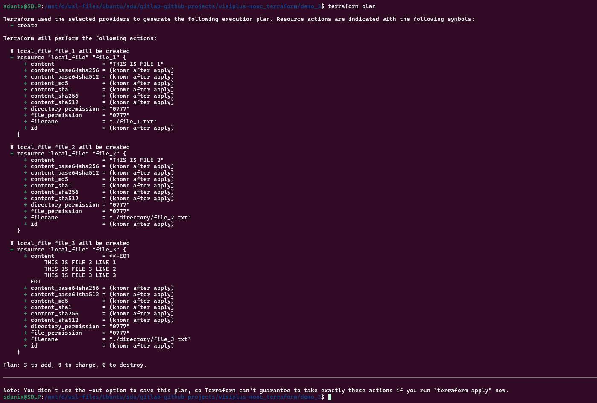
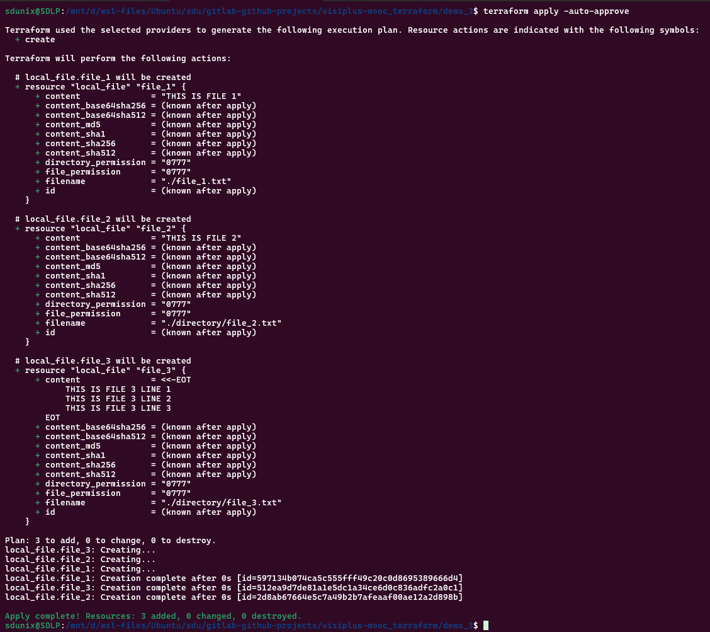
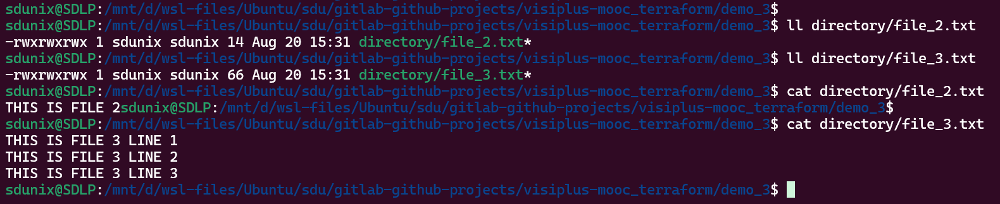
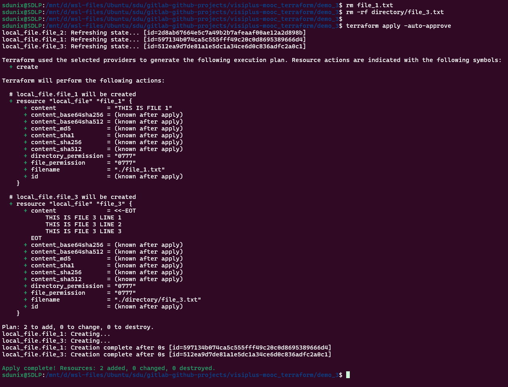
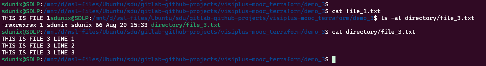
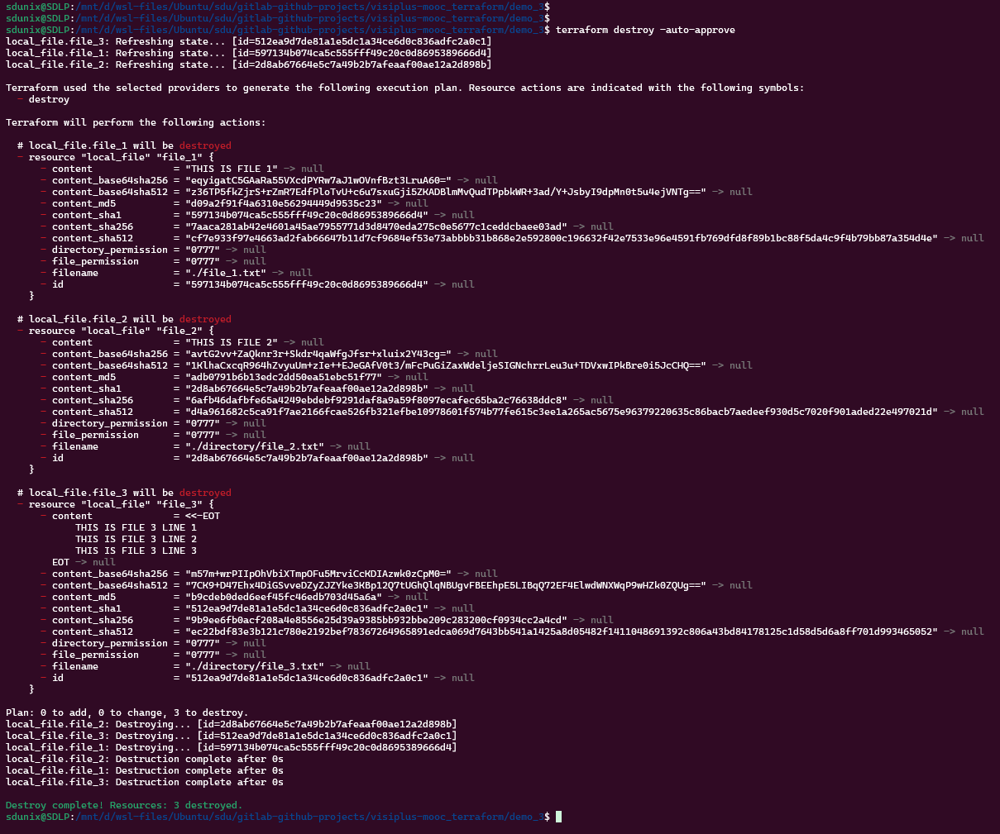

# Demo 3 –  UTILISATION DES COMMANDES TERRAFORM

## Objectifs

1. Créer un fichier nommé `file_1.txt` avec le contenu : `THIS IS FILE 1`.
2. Créer un fichier nommé `file_2.txt` dans le répertoire `directory` avec le contenu : `THIS IS FILE 2`.
3. Exécuter la commande `terraform plan`.
4. Exécuter la commande `terraform apply`.
5. Supprimer un fichier, puis exécuter la commande `terraform apply` à nouveau.

---

## 1. Créer un fichier `file_1.txt` avec le contenu "THIS IS FILE 1"

Dans votre fichier `main.tf`, ajoutez une ressource utilisant le provider `local` :

```hcl
resource "local_file" "file_1" {
  filename = "${path.module}/file_1.txt"
  content  = "THIS IS FILE 1"
}
```

Résultat attendu après `terraform apply` :

* Un fichier `file_1.txt` est créé à la racine du dossier du projet Terraform.
* Son contenu est exactement :
  `THIS IS FILE 1`

---

## 2. Créer un fichier `file_2.txt` dans le répertoire `directory` avec le contenu "THIS IS FILE 2"


Ajoutez ensuite une ressource pour `file_2.txt` dans `main.tf` :

```hcl
resource "local_file" "file_2" {
  filename = "${path.module}/directory/file_2.txt"
  content  = "THIS IS FILE 2"
}
```

Résultat attendu après `terraform apply` :

* Un fichier `file_2.txt` est créé dans le sous-répertoire `directory`.
* Son contenu est exactement :
  `THIS IS FILE 2`

---

## 2.1 Créer un fichier `file_3.txt` dans le répertoire `directory` avec le contenu "THIS IS FILE 2"


Ajoutez ensuite une ressource pour `file_3.txt` dans `main.tf` :

```hcl
resource "local_file" "file_3" {
  filename = "${path.module}/directory/file_3.txt"
  content  = <<-EOF
  THIS IS FILE 3 LINE 1
  THIS IS FILE 3 LINE 2
  THIS IS FILE 3 LINE 3
  EOF
}
```

Résultat attendu après `terraform apply` :

* Un fichier `file_3.txt` est créé dans le sous-répertoire `directory`.
* Son contenu est exactement :
```
THIS IS FILE 3 LINE 1
THIS IS FILE 3 LINE 2
THIS IS FILE 3 LINE 3
```

---

## 3. Exécuter la commande `terraform plan`

Dans le répertoire de votre projet Terraform (là où se trouve `main.tf`), exécutez :

```bash
terraform plan
```

Ce que Terraform affiche typiquement :

* Il indique qu’il va créer 2 ressources `local_file` :

  * `local_file.file_1`
  * `local_file.file_2`
* Vous verrez un résumé du type :
  `Plan: 3 to add, 0 to change, 0 to destroy.`

Aucun changement n’est encore appliqué à votre système de fichiers à cette étape.

---

## 4. Exécuter la commande `terraform apply`

Appliquez le plan :

```bash
terraform apply
```

Vous pouvez valider sans relire le plan en utilisant :

```bash
terraform apply -auto-approve
```

Résultat attendu :

* Terraform crée `file_1.txt` et `directory/file_2.txt` avec les contenus définis.
* À la fin, un message de succès s’affiche avec :
  `Apply complete! Resources: 2 added, 0 changed, 0 destroyed.`

Vérification :

```bash
cat file_1.txt
# THIS IS FILE 1

cat directory/file_2.txt
# THIS IS FILE 2
```

---

## 5. Supprimer un fichier, puis exécuter `terraform apply` à nouveau

Supprimez manuellement un des fichiers gérés par Terraform, par exemple `file_1.txt` :

```bash
rm file_1.txt
```

Puis relancez :

```bash
terraform apply
```

Comportement attendu :

* Terraform détecte que la ressource `local_file.file_1` existe dans l’état Terraform, mais que le fichier réel a disparu du système de fichiers.
* Il planifie la recréation de ce fichier et affiche un plan avec :
  `Plan: 1 to add, 0 to change, 0 to destroy.`
* Après validation, Terraform recrée `file_1.txt` avec le contenu `THIS IS FILE 1`.

Vous pouvez vérifier :

```bash
cat file_1.txt
# THIS IS FILE 1
```

Cela illustre le principe fondamental de Terraform : il tente toujours de ramener l’infrastructure (ici, les fichiers) à l’état décrit dans la configuration.


# ANNEXE : 


```bash
terraform plan
```



```bash
terraform plan
```


```bash
terraform apply -auto-approve
```


```bash
ls -al file_1.txt
cat file_1.txt
```


```bash
# file_2.txt & file_3.txt
cat directory/file_2.txt
cat directory/file_3.txt
ls -al directory/file_2.txt
ls -al directory/file_3.txt
```


```bash
# supprimer file_1.txt & directory/file_2.txt, puis relancer terraform apply
rm file_1.txt
rm -rf directory/file_3.txt
terraform apply -auto-approve
ls -al file_1.txt
cat file_1.txt
ls -al directory/file_3.txt
cat directory/file_3.txt
```




```bash
terraform destroy -auto-approve
```
