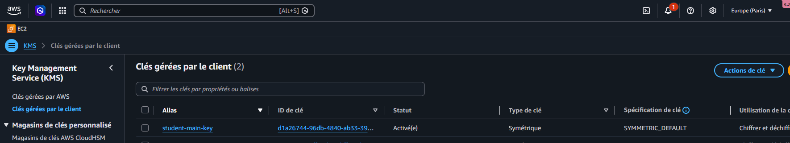
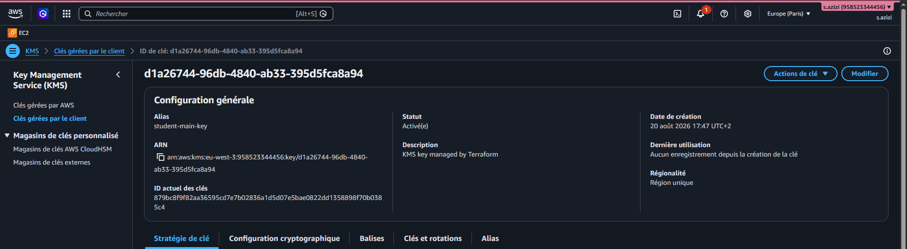
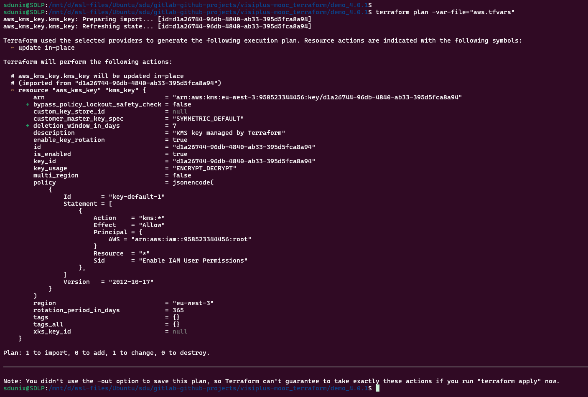
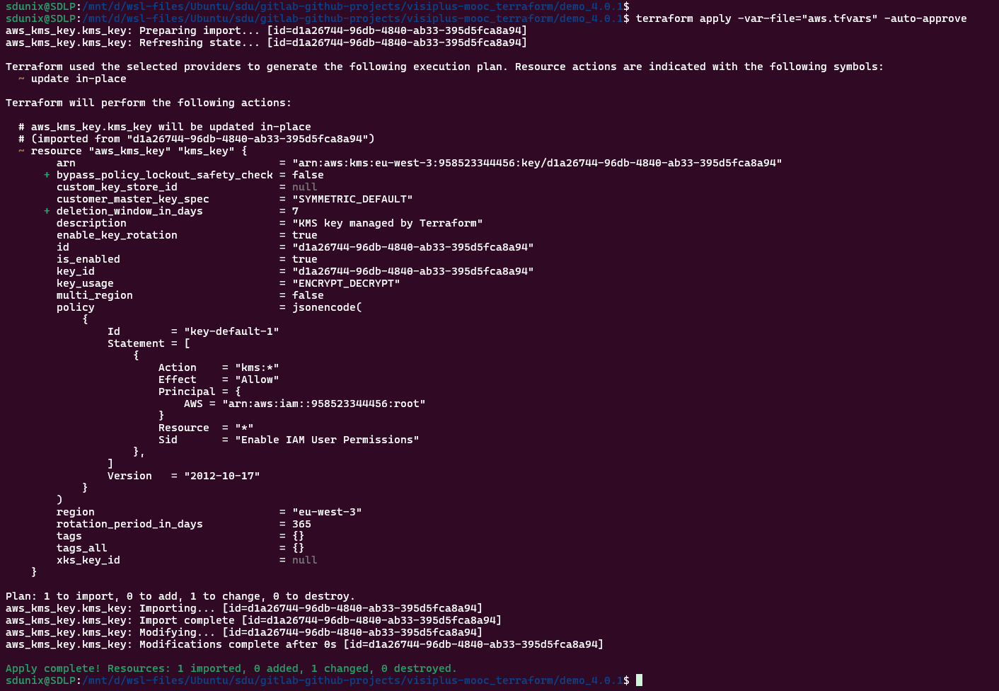

# Demo – une clé KMS existante avec Terraform

## Objectifs

1. Installer le provider AWS
2. Créer les fichier tf
3. Impoter une clé KMS
4. Vérifier avec AWS CLI
---

## 1. Installer le provider AWS

Crée un fichier `main.tf` :

```hcl
terraform {
  required_version = ">= 1.0.0"

  required_providers {
    aws = {
      source  = "hashicorp/aws"
      version = "~> 5.0"
    }
  }
}

provider "aws" {
  region = "eu-west-1"
}
```

Initialise le projet :

```bash
terraform init
```

---

## 2. Créer les fichier tf

Ajoute la ressource suivante dans `kms.tf` :

```hcl
resource "aws_kms_key" "kms_key" {
  description             = "KMS key managed by Terraform"
  deletion_window_in_days = 7
  enable_key_rotation     = true
}

import {
  to = aws_kms_key.kms_key
  id = "d1a26744-96db-4840-ab33-395d5fca8a94"
}
```




---

3. Impoter une clé KMS

Vérifie la configuration :

```bash
terraform fmt
terraform validate
terraform plan -var-file="aws.tfvars"
```


Puis crée les ressources :

```bash
terraform apply -var-file="aws.tfvars" -auto-approve
```


Terraform doit impoter :
- 1 ressource `aws_kms_key`

---

## 4. Vérifier avec AWS CLI

Lister les clés KMS :

```bash
aws kms list-keys
```

Lister les alias :

```bash
aws kms list-aliases
```

Rechercher directement l’alias :

```bash
aws kms describe-key --key-id alias/student-main-key
```

---

## 6. Supprimer la clé KMS

Pour supprimer les ressources Terraform :

```bash
terraform destroy
```

L’alias est supprimé immédiatement.

La clé KMS n’est pas supprimée immédiatement car elle utilise :

```hcl
deletion_window_in_days = 7
```

Elle passe donc dans l’état :

```text
PendingDeletion
```

AWS la supprimera définitivement après 7 jours.